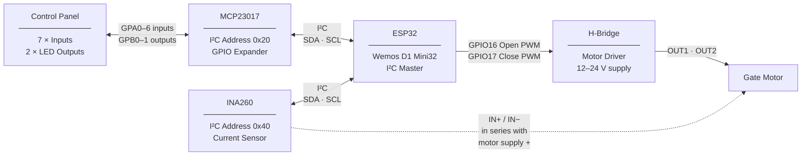

# Gate Controller — Wiring Reference

## System Overview



---

## ESP32 Pin Assignments

| GPIO | Function | Connected To |
|------|----------|-------------|
| GPIO21 | I²C SDA | MCP23017 SDA, INA260 SDA |
| GPIO22 | I²C SCL | MCP23017 SCL, INA260 SCL |
| GPIO16 | Motor Open PWM | H-Bridge IN1 |
| GPIO17 | Motor Close PWM | H-Bridge IN2 |
| GPIO2 | Status LED (onboard) | — (built-in) |

> All logic runs at 3.3 V. The ESP32 supplies 3.3 V to the MCP23017 and INA260.

---

## MCP23017 — I²C GPIO Expander

**I²C address:** 0x20 — tie A0, A1, A2 all to GND.

### Port A — Inputs (GPA0–GPA7)

All Port A pins are configured with internal pull-ups and read active-low. Each input connects to GND through a momentary switch or endstop contact.

| Pin | Function | Notes |
|-----|----------|-------|
| GPA0 | Open endstop | Closes to GND when gate is fully open |
| GPA1 | Close endstop | Closes to GND when gate is fully closed |
| GPA2 | Cycle button | Momentary, to GND |
| GPA3 | Open button (hold-to-operate) | Hold to jog open, release to stop |
| GPA4 | Close button (hold-to-operate) | Hold to jog close, release to stop |
| GPA5 | Stop button | Momentary, to GND |
| GPA6 | Reboot/Reset button | Hold 3 s = reboot · Hold 10 s = reset learned times + reboot |
| GPA7 | Spare | — |

### Port B — Outputs (GPB0–GPB7)

| Pin | Function | Notes |
|-----|----------|-------|
| GPB0 | Open LED | Wire in series with a current-limiting resistor to GND |
| GPB1 | Close LED | Wire in series with a current-limiting resistor to GND |
| GPB2–GPB7 | Spare | — |

> **LED wiring:** MCP23017 outputs source ~25 mA max. Use a resistor appropriate for your LED forward voltage (typically 100–470 Ω for 3.3 V operation). Connect LED anode to 3.3 V and cathode through resistor to GPBx, or wire GPBx → resistor → LED anode → GND (active-high drive).

### Power

| Pin | Connection |
|-----|-----------|
| VDD | 3.3 V from ESP32 |
| VSS | GND (common with ESP32) |
| RESET | 3.3 V (or tie to ESP32 reset if desired) |
| A0, A1, A2 | GND (sets address to 0x20) |

---

## INA260 — Current Sensor

**I²C address:** 0x40 — tie the VS (address) pin to GND.

The INA260 measures motor current by sitting **in series** with the motor power supply line. Route the motor + supply wire through the IN+ and IN− terminals rather than connecting them directly to the motor.

```
12–24 V Supply (+) ──→ INA260 IN+ ──→ INA260 IN− ──→ H-Bridge VCC
                           ↑                ↑
                     current flows through internal shunt
```

| Pin | Connection |
|-----|-----------|
| SDA | ESP32 GPIO21 (shared I²C bus) |
| SCL | ESP32 GPIO22 (shared I²C bus) |
| VCC | 3.3 V from ESP32 |
| GND | Common GND |
| IN+ | From motor power supply + |
| IN− | To H-Bridge motor supply input |
| VS / A0 | GND (sets address to 0x40) |

> **Polarity:** Current flows from IN+ to IN−. Opening direction reads positive, closing reads negative. If the signs are reversed in HA, swap the IN+ and IN− connections.

---

## H-Bridge Motor Driver

The H-bridge receives two independent PWM signals from the ESP32 — one for each direction. Apply PWM to IN1 to drive the motor open; apply PWM to IN2 to drive it closed. The controller never drives both simultaneously.

| H-Bridge Pin | Connection |
|-------------|-----------|
| IN1 (or ENA/PWM A) | ESP32 GPIO16 |
| IN2 (or ENB/PWM B) | ESP32 GPIO17 |
| OUT1 | Motor terminal A |
| OUT2 | Motor terminal B |
| VCC / VM | 12–24 V motor supply (through INA260 IN+/IN−) |
| GND | Common GND |
| Logic VCC (if separate) | 3.3 V or 5 V per driver spec |

> Specific pin names vary by H-bridge module. The key requirement is two independent PWM inputs that individually control each drive direction.

---

## Common Wiring Notes

**Ground:** All components must share a common GND — ESP32, MCP23017, INA260, H-bridge, and the motor power supply.

**I²C bus:** SDA and SCL are shared between the MCP23017 and INA260. Both devices connect to the same two GPIO pins on the ESP32. Pull-up resistors (4.7 kΩ to 3.3 V) are recommended on SDA and SCL if the bus runs more than a few centimetres or if the built-in pull-ups are insufficient. The firmware runs the I²C bus at 10 kHz for reliability over longer cable runs.

**Endstops:** Can be normally-open (NO) or normally-closed (NC) switches. The firmware reads active-low (switch closes to GND = active). Configure inverted: true in the YAML pin definition if using NC switches.

**Motor power isolation:** The motor supply (12–24 V) must be isolated from the logic supply (3.3 V / 5 V). Only GND is shared. Do not connect the motor supply rail to the ESP32 VCC or 3.3 V pins.
